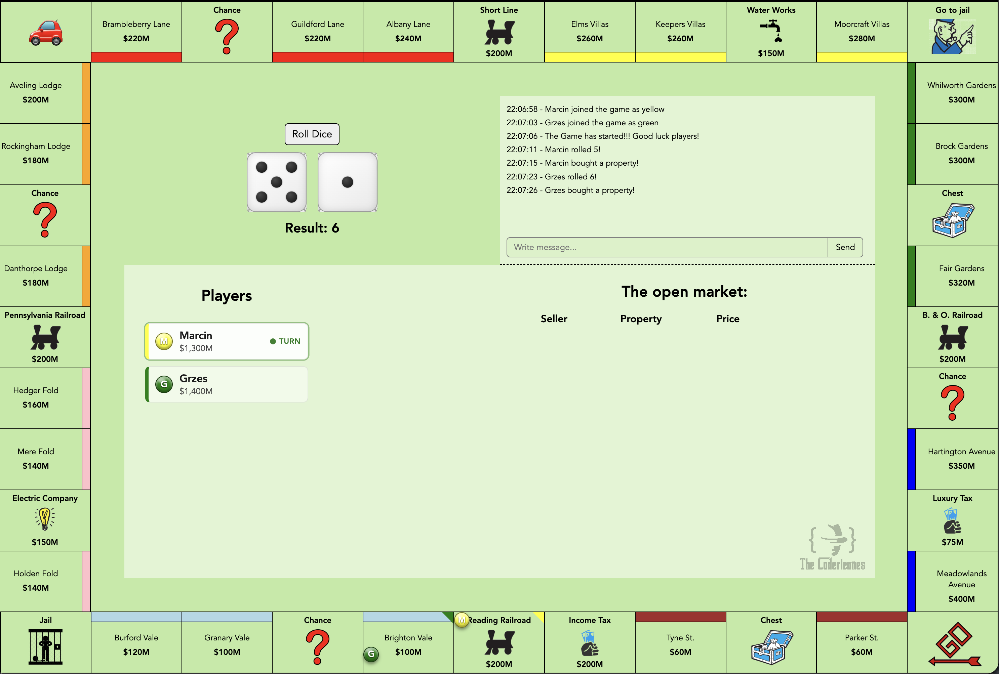

# Monopoly Websockets

[](https://monopoly.michalik.no)

[](https://github.com/terragady/monopoly-websockets/actions/workflows/ci.yml)


Real-time multiplayer Monopoly you can play in the browser with friends over a
shared room code.

**▶ Play it live at [monopoly.michalik.no](https://monopoly.michalik.no)** — grab a
room code and share it with friends.

This started life as a small 2020 hobby project and has since been **rewritten from
the ground up**: the original single-file Express + Create React App codebase (one
global game, all logic on the client, easily cheated) is now a typed pnpm monorepo
with an **authoritative game server**, **isolated game rooms**, sanitised chat, and
an animated, polished UI. See [What changed in the rewrite](#what-changed-in-the-rewrite).

Everything that happens is written to the in-game log / chat — keep an eye on it!



## What changed in the rewrite

| Then (2020) | Now |
| --- | --- |
| Create React App + single `server.js` | pnpm monorepo — `apps/server`, `apps/client`, `packages/shared` |
| Plain JavaScript | End-to-end **TypeScript**, incl. typed Socket.IO event contracts |
| One global game for everyone | **Isolated rooms** — share a code to play together |
| Client decided dice, money & moves (cheatable) | **Server-authoritative** dice, movement, rent and turn order |
| Chat rendered raw HTML (XSS) | Chat + names sanitised |
| Chance drew from the Community Chest deck | Separate, expanded **Chance / Community Chest** decks |
| Static board, instant token jumps | **Animated** 3D dice, tile-by-tile token movement, card flips, modal prompts |
| Committed build output, mixed yarn/npm lockfiles | Clean workspace, single pnpm lockfile, Docker + Render deploy configs |

## Tech stack

- **Monorepo:** pnpm workspaces — `apps/server`, `apps/client`, `packages/shared`.
- **Server:** Express + Socket.IO (TypeScript, run directly with `tsx`). Game state
  lives in memory, one independent game per room.
- **Client:** React 19 + Vite (TypeScript).
- **Shared:** board data, card decks, and the end-to-end typed Socket.IO event
  contracts imported by both sides via `@monopoly/shared`.

Front-end ⇄ back-end communication is over WebSockets. State changes are applied on
the server and pushed to every client in the room, so all players see the same board.

## Getting started

Requires **Node 24 (LTS)** and **pnpm** (via `corepack enable`).

```bash
pnpm install
pnpm dev
```

`pnpm dev` runs both apps in parallel:

- server on `http://localhost:8080`
- client on `http://localhost:5173` (Vite proxies `/socket.io` to the server)

Open `http://localhost:5173`, enter a name and a **room code** (leave it blank to join
the default `LOBBY` room), and share the code with friends to play together. Open a
second tab / browser to add another player.

### Useful scripts

```bash
pnpm dev         # run server + client together
pnpm build       # build the client bundle
pnpm start       # start the server (serves the built client in production)
pnpm typecheck   # tsc --noEmit across all packages
pnpm lint        # eslint across the repo
```

## Environment variables

| Variable      | Where   | Default                     | Notes                                              |
| ------------- | ------- | --------------------------- | -------------------------------------------------- |
| `PORT`        | server  | `8080`                      | Port the server listens on.                        |
| `NODE_ENV`    | server  | –                           | Set to `production` to serve the built client.     |
| `CORS_ORIGIN` | server  | Vite origin (dev)           | Allowed origin; in prod it reflects same-origin.   |
| `CLIENT_DIST` | server  | `apps/client/dist`          | Override the static client directory if needed.    |

## Deployment

The Node server serves the built client from the same origin (no separate CORS
config needed), so the whole app ships as a **single service**.

### Render (Blueprint)

A [`render.yaml`](./render.yaml) blueprint is included (single free web service).
In the Render dashboard: **New → Blueprint**, point it at this repo, and deploy.
It runs:

```bash
# build
corepack enable && pnpm install --frozen-lockfile && pnpm --filter @monopoly/client build
# start
pnpm --filter @monopoly/server start
```

Health check path is `/healthz`. Expect a one-time cold start on the free plan.

### Docker / Cloud Run

A multi-stage [`Dockerfile`](./Dockerfile) builds the client and runs the server.

```bash
docker build -t monopoly-websockets .
docker run -p 8080:8080 -e NODE_ENV=production monopoly-websockets
# → http://localhost:8080
```

Deploy the same image to Cloud Run (keep it cheap with a single instance):

```bash
gcloud run deploy monopoly-websockets \
  --source . \
  --region europe-west1 \
  --allow-unauthenticated \
  --max-instances=1
```

> Cloud Run bills per request/CPU; `--max-instances=1` plus a budget alert keeps a
> hobby deploy from surprising you.

## Gameplay FAQ

**How do I chat with other players?** There's a chat in the log panel — use it.

**Can spectators join?** Yes. Anyone who joins a room after its game has started
joins as a spectator (and can still chat).

**How do I trade?**
- *Private sale:* click another player's property and submit an offer. The owner has
  20 seconds to accept or decline, and you're notified of their decision.
- *Open market:* click your own property, choose **Sell**, and set a price. Any player
  in the room can then buy it; you can also pull it back off the market.

**What happens when I go bankrupt?** You're out, and your properties return to the open
market — but you can keep spectating and chatting.

**How do I win?** Be the last player who isn't bankrupt.

## Roadmap

- [x] pnpm monorepo + Vite + full TypeScript conversion
- [x] Server-authoritative state pushed to all clients
- [x] Server-side validation (reject out-of-turn / unaffordable / not-owner actions)
- [x] Isolated game rooms (share a room code to play together)
- [x] Chat input sanitisation (no HTML injection)
- [x] Separate, expanded Chance / Community Chest decks
- [x] Animated 3D dice, tile-by-tile token movement, card flips and modal prompts
- [x] Building houses / hotels and the rent tiers they unlock
- [x] Colour-group monopoly rent bonus (owning a full set)
- [x] Mortgaging properties for cash
- [x] Auctions when a player declines to buy an unowned tile
- [x] "Get out of jail free" card and paying $50 to leave jail
- [x] Property trading (private offers and an open market)
- [x] A dedicated win screen

Ideas for later:

- [ ] Persist games so they survive a server restart (state is in-memory only)
- [ ] Reconnect to your seat after a dropped connection (you're currently removed on disconnect)
