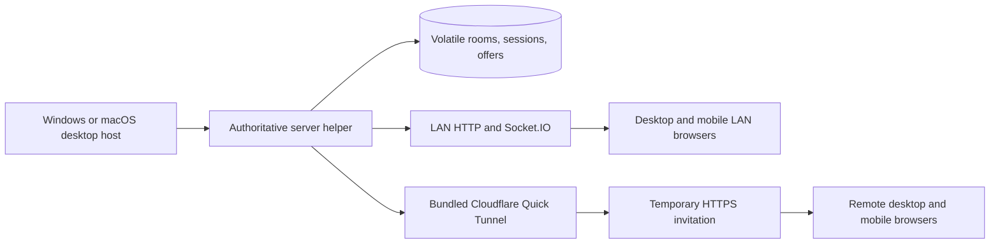

# Own the Block — implementation guide

This directory is the source of truth for current behavior. The host desktop application's server helper is the only gameplay authority. It stores room snapshots, session hashes, offers and deadlines in process RAM. A helper exit permanently destroys those matches. Protocol v11 and snapshot schema v10 still describe the in-memory room shape; they do not imply durable storage.

The migration findings and implementation choices are recorded in [RAM hosting discovery](./RAM-HOSTING-DISCOVERY.md).
Executed gates and remaining device checks are recorded in the [verification report](./RAM-HOSTING-VERIFICATION.md).

## Current architecture



The Electron shell starts and stops the helper and tunnel. Every client action is validated by the helper; a helper exit destroys the RAM aggregate and its reconnect credentials.

## Read order

1. [Shared instructions](./monopoly.shared.instructions.md).
2. The block instructions and module index for the code being changed.
3. [RAM lifecycle and storage](./Persistence/README.md), [HTTP and hosting](./Api/http-runtime.instruction.md), and the related [testcases](./testcase/README.md).

| Block | Code | Guide |
| --- | --- | --- |
| Client | `apps/client/` | [Client instructions](./monopoly.client.instructions.md), [index](./Client/README.md) |
| Desktop | `apps/desktop/` | [HTTP and hosting](./Api/http-runtime.instruction.md), [Client join](./Client/join-room.instruction.md) |
| HTTP/Socket | `apps/server/src/createServer.ts`, `socket/` | [API instructions](./monopoly.api.instructions.md), [index](./Api/README.md) |
| GameCore | `apps/server/src/rooms.ts`, `game/` | [GameCore instructions](./monopoly.game-core.instructions.md), [index](./GameCore/README.md) |
| Volatile store | `apps/server/src/persistence/`, `services/` | [Persistence](./Persistence/README.md) |
| Contracts | `packages/shared/src/` | [Shared instructions](./monopoly.contracts.instructions.md), [index](./Shared/README.md) |
| Tests | `apps/**/*.test.ts*`, packaged proofs | [Testcase index](./testcase/README.md) |

The old `apps/server/migrations/` SQL files are historical schema artifacts only. They are never loaded by the current runtime or package build. Any older module guide that describes PostgreSQL, database recovery or managed PostgreSQL is superseded by the RAM lifecycle in this index and [Persistence](./Persistence/README.md); its gameplay/protocol rules still apply where code and tests confirm them.

## Required gates

```bash
pnpm typecheck
pnpm lint
pnpm test
pnpm build
pnpm desktop:package
pnpm desktop:proof:host
```

The packaged proof checks a real bundled helper, four clients, LAN reachability/discovery, reconnect, and that a helper restart rejects the old room and token. Physical Windows/macOS and mobile device checks, macOS packaging, and independent-network online checks remain separate evidence. Do not label them automated without a corresponding executed assertion.
