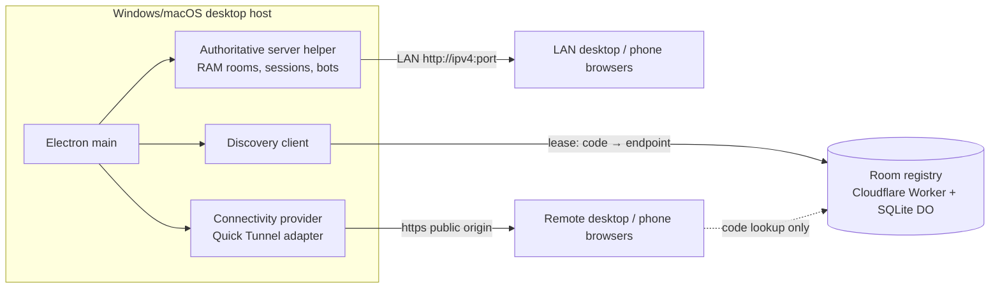

# Online multiplayer design (R3)

## 1. Topology (unchanged authority)

- The helper is the only gameplay authority. The registry stores `roomCode → public endpoint` leases and
  nothing else: no game state, players, tokens, database credentials or chat. Gameplay never passes through it.
- **Connectivity provider** (`apps/desktop/src/online/connectivity.ts`, interface `ConnectivityProvider
  { start(localEndpoint, onLost): Promise<endpoint>; stop() }`) decides how traffic reaches the helper. The
  shipped adapter is the bundled, digest-pinned `cloudflared` Quick Tunnel. Replacing it (Named Tunnel, another
  tunnel service, a port-forwarded origin) means a new adapter plus one entry in the public endpoint policy.
- **Discovery provider** (`apps/desktop/src/online/discovery.ts`, `HttpRoomDiscovery`) decides how a typed code
  finds an endpoint. Optional: a full invitation link already carries the endpoint.
- **LAN** never depends on either: LAN hosting starts without Internet, tunnel or registry; LAN code lookup is
  UDP broadcast inside the subnet (`lanFinder.ts` ↔ `lanDiscoveryResponder.ts`).

## 2. Provider facts (verified 2026-10-09 against official docs)

| Fact | Source |
| --- | --- |
| Quick Tunnels are for development/testing, have **no uptime guarantee**, a new random hostname per tunnel, at most **200 in-flight requests** (then 429), no SSE | developers.cloudflare.com, "Quick Tunnels" (trycloudflare) page |
| Workers Free plan supports **SQLite-backed Durable Objects only**; 100,000 requests/day, 5 M rows read and 100,000 rows written per day, 5 GB stored; over-limit operations fail until 00:00 UTC | developers.cloudflare.com, Durable Objects pricing |
| Edge sets `CF-Connecting-IP` and answers 403 to a visitor-supplied one; cloudflared fails with a user `config.yml` `name:` / `TUNNEL_NAME` unless isolated | measured 2026-10-08 (RAM remediation record) |

Classification: **Quick Tunnel = experimental / personal use**, not production. A supportable production setup
is a Named Tunnel on a Cloudflare account with the owner's domain (free account, domain needed), which
requires account/token provisioning the program does not have → not implemented, documented as the upgrade
path. The registry on Workers Free is viable for a hobby load (each join is one read; a hosted room renews every
30 s ≈ 2,880 writes/day per room-day, so ≈ 30 concurrently hosted rooms all day stay under the write budget).

## 3. Codes, links and the single Join field

- Code: `OTB-` + 6 characters from `ABCDEFGHJKLMNPQRSTUVWXYZ23456789` (≈ 1.07 × 10⁹ codes), made by the host
  renderer, upper-cased, whitespace-trimmed. A code is **not a credential**: it lets someone ask to join a lobby,
  which is its purpose; guessing is bounded by the registry budget (60 lookups/min per client IP) and the host's
  `/_otb/room` limiter (60/min) and admission limiter.
- LAN link: `http://<private IPv4>:<port>/?room=<CODE>`; Online link: `https://<tunnel origin>/?room=<CODE>`.
  Links, QR payloads and registry entries contain only origin + room code. No token, capability, proof or
  owner credential ever appears in them (existing tests plus new parser tests).
- `parseJoinInput(text)` (one shared parser, client `runtime/joinTargetResolver.ts`, used by the desktop launcher
  **and** the browser join form) returns `code`, `invitation {endpoint, roomCode}` or `invalid`:
  - trims, accepts lower case, accepts a pasted link with or without `http(s)://` for LAN;
  - accepts exactly one `room` parameter, no fragment, no credentials, no extra path;
  - endpoint must pass the **public endpoint policy** (`packages/shared/src/endpointPolicy.ts`, the single place that
    names provider hostnames) or be a private-LAN IPv4 with port; anything else (`javascript:`, `file:`,
    `data:`, foreign hosts, IP literals on the public Internet, ports on HTTPS tunnel origins) is `invalid`.
- Browser join form: a link navigates to that validated origin with `?room=`; a code joins this host; when this
  host does not have the code and a registry URL is known, it resolves the code and asks before switching hosts;
  otherwise it says the code is not on this host and to use the invitation link.
- Desktop launcher: link → direct; code → LAN UDP lookup and registry lookup in parallel. When both answer, the
  two endpoints are compared by the helper's non-secret per-process `instanceId` from `/_otb/room`; the same host
  prefers LAN, two different hosts stay an explicit "ambiguous" error (never a silent pick).

## 4. Discovery lifecycle

| Event | Behaviour |
| --- | --- |
| Online host start | `reserve` (180 s) before the tunnel; a failure leaves a link-only room and is now reported (`DISCOVERY_UNAVAILABLE`), never silently hidden |
| Room created + public probe OK | `activate`: the registry fetches `<endpoint>/_otb/registry-proof` and checks proof + code; lease 90 s |
| Every 30 s | `renew`; failure → `DISCOVERY_UNAVAILABLE` with Retry, the link/QR stay visible |
| Activation failure | link/QR stay visible (`READY` + `DISCOVERY_UNAVAILABLE`); previously the whole Online state became `UNAVAILABLE` |
| Tunnel lost | link hidden, lease suspended, tunnel retried; a new hostname re-activates the lease to the new endpoint |
| Host quit | lease revoked, tunnel stopped |
| Helper crash / host kill | terminal; no restart under the old match; lease expires by TTL ≤ 90 s; lookups then return `NOT_FOUND` |
| Registry not configured (default build without the owner's URL) | state `DISCOVERY_DISABLED`; sharing says "share the link or QR"; bare-code lookup across networks unavailable — honest, not a failure |

Configuration: runtime `OWN_THE_BLOCK_REGISTRY_URL` (existing) or a build-time value written by the package step
from the CI variable `OWN_THE_BLOCK_REGISTRY_URL` into `resources/online-config.json`; HTTPS only.
The registry gains CORS **only** on `GET /v1/rooms/:code` (public answer: code, endpoint, expiry) and a tiny
static `/join` page (type a code → resolve → open the host's link). Owner-only routes keep Bearer auth and no CORS.

## 5. Reconnect and session safety

- Tokens stay client-side, scoped to the server authority; the server stores SHA-256 hashes only.
- A public code or link never grants a seat: in a started room a newcomer is a read-only spectator; only the
  original token resumes the original seat; the newest connection wins; stale disconnects are blocked by the
  connection generation (existing, covered by integration tests; extended with cross-room token and replay cases).
- **Endpoint refresh** (new): when a web/desktop guest has been unable to reach its endpoint for 20 s, the
  reconnect overlay says the host link may have changed; it (a) resolves the room code through the registry when
  available and reconnects the socket to the new endpoint with the same in-memory/storage token, or (b) accepts a
  pasted new invitation link for the **same room code** and does the same. The token never travels in a URL.
- Messages: `Reconnecting…` (transport loss), `Host link changed — paste the new link` (endpoint unreachable),
  `This room has closed` (`SESSION_INVALID` / `ROOM_GONE` after the helper exited), `Room full`, `Game already
  started`, `Code not found / expired`, `Invalid link`, `Online service unavailable`.

## 6. Threats and mitigations

| Threat | Mitigation |
| --- | --- |
| Code guessing / enumeration | 32⁶ space, registry per-IP budget, host `/_otb/room` limiter, admission limiter; codes reveal only an endpoint |
| Stale / ghost registry entry | 90 s lease TTL, revoke on quit, suspend on tunnel loss, activation requires a live proof from the endpoint |
| Wrong-host delivery after code reuse | lease owner token (hashed) per code; activation proof binds code ↔ endpoint; client re-checks the code returned |
| Malicious URL input | single parser + endpoint policy; no redirects followed by discovery (`redirect: 'error'`) |
| Forged commands / cross-room | actor from `socket.data.playerId`; room from the session; bots driven only server-side |
| Unauthorized bot control | `add bot` / `remove bot` host-only, lobby-only, validated payloads |
| Exposed services | helper exposes only HTTP + Socket.IO; no database exists; no admin API; Electron IPC whitelist unchanged |
| Secrets in logs | bot decision logs carry ids, kinds and choices only; existing redaction tests extended |

## 7. Cost and capacity honesty

No paid service is required. LAN needs nothing external. Online-by-link needs only the bundled Quick Tunnel
(no account). Online-by-code needs the owner's free Cloudflare account to deploy the registry. Capacity claims are
limited to what is measured; the 20–50 remote users across several rooms target (NET-10 / AC-R07) needs real
remote machines and stays `NOT RUN / BLOCKED` until run. One Quick Tunnel caps a host at 200 in-flight requests.
